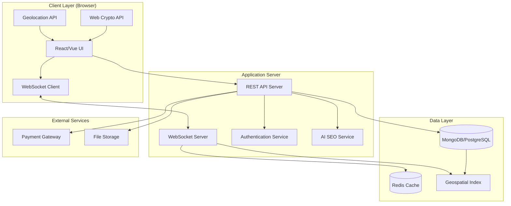

# Design Document: SocialHive Platform

## Overview

SocialHive is a web-based professional networking platform that combines real-time geolocation discovery with career collaboration features. The system uses a radar-based interface for discovering nearby professionals, implements progressive trust-building through mutual connections, and provides encrypted communication channels. The platform operates in two modes: "Find a Partner" for individual professional networking and "Find a Team Mate" for project-based collaboration.

The architecture follows a client-server model with real-time WebSocket connections for location updates and notifications, RESTful APIs for CRUD operations, and end-to-end encryption for secure messaging.

## Architecture

### High-Level Architecture



### Technology Stack

**Frontend:**
- Framework: React or Vue.js for dynamic UI
- State Management: Redux/Vuex for application state
- WebSocket Client: Socket.IO client for real-time communication
- Mapping: Leaflet.js or custom canvas for radar visualization
- Encryption: Web Crypto API for client-side encryption
- Geolocation: HTML5 Geolocation API

**Backend:**
- Runtime: Node.js with Express or Python with FastAPI
- WebSocket Server: Socket.IO or native WebSocket
- Authentication: JWT (JSON Web Tokens)
- AI/ML: TensorFlow.js or Python ML libraries for keyword optimization

**Database:**
- Primary: MongoDB (for flexible schema and native geospatial support) or PostgreSQL with PostGIS
- Cache: Redis for session management and real-time data
- Geospatial Indexing: 2dsphere index (MongoDB) or GiST index (PostGIS)

**Infrastructure:**
- File Storage: AWS S3 or similar for profile photos
- CDN: CloudFront or similar for static assets
- Payment: Stripe API for subscription management

## Components and Interfaces

### 1. Authentication System

**Components:**
- `AuthController`: Handles registration, login, logout
- `TokenManager`: Manages JWT generation and validation
- `SessionStore`: Redis-based session storage

**Interfaces:**
```typescript
interface User {
  id: string;
  email: string;
  passwordHash: string;
  createdAt: Date;
  lastLogin: Date;
}

interface AuthToken {
  userId: string;
  token: string;
  expiresAt: Date;
}

// API Endpoints
POST /api/auth/register
POST /api/auth/login
POST /api/auth/logout
POST /api/auth/refresh
```

### 2. Profile Management System

**Components:**
- `ProfileController`: CRUD operations for profiles
- `PhotoUploadService`: Handles photo uploads to storage
- `ProfileValidator`: Validates profile data
- `AIKeywordOptimizer`: Optimizes profile keywords

**Interfaces:**
```typescript
interface Profile {
  userId: string;
  name: string;
  age: number;
  place: string;
  skills: string[];
  profession: string;
  photos: string[]; // URLs, max 5
  bio: string;
  college?: string;
  company?: string;
  verified: boolean;
  websiteUrl?: string;
  achievements?: string[];
  optimizedKeywords: string[]; // AI-generated
  createdAt: Date;
  updatedAt: Date;
}

// API Endpoints
POST /api/profiles
GET /api/profiles/:userId
PUT /api/profiles/:userId
DELETE /api/profiles/:userId
POST /api/profiles/:userId/photos
DELETE /api/profiles/:userId/photos/:photoId
```

### 3. Geolocation and Radar System

**Components:**
- `LocationService`: Manages user location updates
- `RadarEngine`: Calculates nearby users and renders radar
- `DistanceCalculator`: Computes distances between coordinates
- `VisibilityManager`: Controls Explore/Vanish mode

**Interfaces:**
```typescript
interface Location {
  userId: string;
  coordinates: {
    latitude: number;
    longitude: number;
  };
  timestamp: Date;
  accuracy: number; // meters
}

interface RadarDot {
  userId: string;
  distance: number; // meters
  gender: 'male' | 'female';
  coordinates: {
    latitude: number;
    longitude: number;
  };
}

interface VisibilityState {
  userId: string;
  mode: 'explore' | 'vanish';
  updatedAt: Date;
}

// WebSocket Events
emit('location:update', Location)
on('radar:update', RadarDot[])
emit('visibility:toggle', VisibilityState)
on('nearby:notification', { userId: string, distance: number })

// API Endpoints
POST /api/location/update
GET /api/radar/nearby?lat=X&lng=Y&radius=Z
PUT /api/visibility/mode
```

**Geospatial Query Implementation:**

For MongoDB:
```javascript
// Find users within radius
db.locations.find({
  coordinates: {
    $nearSphere: {
      $geometry: {
        type: "Point",
        coordinates: [longitude, latitude]
      },
      $maxDistance: radiusInMeters
    }
  },
  userId: { $ne: currentUserId },
  mode: 'explore'
})
```

For PostgreSQL with PostGIS:
```sql
-- Find users within radius
SELECT user_id, ST_Distance(location, ST_MakePoint(lng, lat)::geography) as distance
FROM user_locations
WHERE ST_DWithin(
  location,
  ST_MakePoint(lng, lat)::geography,
  radius_in_meters
)
AND user_id != current_user_id
AND mode = 'explore'
ORDER BY distance;
```

### 4. Connection Request System

**Components:**
- `ConnectionController`: Manages connection requests
- `MutualRequestDetector`: Detects when both users accept
- `FriendListManager`: Maintains friend relationships

**Interfaces:**
```typescript
interface ConnectionRequest {
  id: string;
  senderId: string;
  receiverId: string;
  status: 'pending' | 'accepted' | 'declined';
  createdAt: Date;
  respondedAt?: Date;
}

interface Friendship {
  id: string;
  user1Id: string;
  user2Id: string;
  establishedAt: Date;
  communicationLevel: 'chat' | 'voice' | 'video';
  interactionCount: number;
}

// API Endpoints
POST /api/connections/request
PUT /api/connections/:requestId/accept
PUT /api/connections/:requestId/decline
GET /api/connections/pending
GET /api/friends
DELETE /api/friends/:friendshipId
POST /api/friends/:friendshipId/block
```

### 5. Encrypted Communication System

**Components:**
- `MessageController`: Handles message routing
- `EncryptionService`: Manages encryption keys
- `ChatRoomManager`: Manages chat sessions
- `CallManager`: Handles voice/video call signaling

**Interfaces:**
```typescript
interface EncryptionKeys {
  userId: string;
  publicKey: string;
  privateKey: string; // stored client-side only
  createdAt: Date;
}

interface Message {
  id: string;
  senderId: string;
  receiverId: string;
  encryptedContent: string; // encrypted with receiver's public key
  timestamp: Date;
  delivered: boolean;
  read: boolean;
}

interface ChatRoom {
  id: string;
  type: 'personal' | 'group';
  participants: string[]; // userIds
  gigId?: string; // for group chats
  createdAt: Date;
}

interface CallSession {
  id: string;
  type: 'voice' | 'video';
  initiatorId: string;
  participantIds: string[];
  status: 'ringing' | 'active' | 'ended';
  startedAt?: Date;
  endedAt?: Date;
}

// WebSocket Events
emit('message:send', Message)
on('message:receive', Message)
emit('call:initiate', CallSession)
on('call:incoming', CallSession)
emit('call:accept', { callId: string })
emit('call:reject', { callId: string })

// API Endpoints
POST /api/messages
GET /api/messages/chat/:chatRoomId
POST /api/keys/exchange
GET /api/keys/:userId/public
POST /api/calls/initiate
PUT /api/calls/:callId/end
```

**Encryption Flow:**

1. **Key Generation (Client-side):**
```javascript
// Generate RSA key pair on client
const keyPair = await window.crypto.subtle.generateKey(
  {
    name: "RSA-OAEP",
    modulusLength: 2048,
    publicExponent: new Uint8Array([1, 0, 1]),
    hash: "SHA-256"
  },
  true,
  ["encrypt", "decrypt"]
);

// Export public key to server
const publicKey = await window.crypto.subtle.exportKey("spki", keyPair.publicKey);
```

2. **Message Encryption:**
```javascript
// Fetch receiver's public key
const receiverPublicKey = await fetchPublicKey(receiverId);

// Encrypt message
const encryptedContent = await window.crypto.subtle.encrypt(
  { name: "RSA-OAEP" },
  receiverPublicKey,
  messageBuffer
);
```

3. **Message Decryption:**
```javascript
// Decrypt with private key (stored in browser)
const decryptedContent = await window.crypto.subtle.decrypt(
  { name: "RSA-OAEP" },
  privateKey,
  encryptedBuffer
);
```

### 6. Gig Management System

**Components:**
- `GigController`: CRUD operations for gigs
- `GigSearchEngine`: Filters and searches gigs
- `ApplicationManager`: Handles gig applications

**Interfaces:**
```typescript
interface Gig {
  id: string;
  creatorId: string;
  title: string;
  description: string;
  skillsRequired: string[];
  type: 'hackathon' | 'project' | 'startup' | 'job';
  paymentStatus: 'paid' | 'unpaid';
  chatRoomId: string;
  applicants: string[]; // userIds
  createdAt: Date;
  updatedAt: Date;
}

interface GigApplication {
  id: string;
  gigId: string;
  applicantId: string;
  status: 'pending' | 'accepted' | 'rejected';
  appliedAt: Date;
}

// API Endpoints
POST /api/gigs
GET /api/gigs
GET /api/gigs/:gigId
PUT /api/gigs/:gigId
DELETE /api/gigs/:gigId
POST /api/gigs/:gigId/apply
GET /api/gigs/:gigId/applicants
PUT /api/gigs/:gigId/applicants/:applicantId/accept
```

### 7. AI SEO Optimization Service

**Components:**
- `KeywordExtractor`: Extracts keywords from profile
- `SemanticAnalyzer`: Analyzes semantic meaning
- `RankingOptimizer`: Optimizes for search ranking

**Interfaces:**
```typescript
interface OptimizationRequest {
  profileId: string;
  skills: string[];
  profession: string;
  bio: string;
  achievements?: string[];
}

interface OptimizationResult {
  profileId: string;
  keywords: string[];
  semanticTags: string[];
  rankingScore: number;
  suggestions: string[];
}

// API Endpoints
POST /api/ai/optimize-profile
GET /api/ai/profile-score/:profileId
```

**AI Optimization Algorithm:**

1. **Keyword Extraction:**
   - Extract nouns and technical terms from bio, skills, profession
   - Use TF-IDF (Term Frequency-Inverse Document Frequency) to identify important terms
   - Generate synonyms and related terms using word embeddings

2. **Semantic Analysis:**
   - Use NLP to understand context and intent
   - Map skills to industry categories
   - Identify niche specializations

3. **Ranking Optimization:**
   - Calculate profile completeness score
   - Weight keywords by relevance to user's niche
   - Generate optimized keyword list for search indexing

### 8. Search and Filter System

**Components:**
- `SearchEngine`: Full-text search across profiles and gigs
- `FilterProcessor`: Applies multiple filters
- `RankingAlgorithm`: Ranks results by relevance

**Interfaces:**
```typescript
interface SearchQuery {
  query?: string;
  filters: {
    skills?: string[];
    profession?: string;
    niche?: string;
    distance?: number; // meters
    gigType?: string;
  };
  location?: {
    latitude: number;
    longitude: number;
  };
  page: number;
  limit: number;
}

interface SearchResult {
  results: (Profile | Gig)[];
  total: number;
  page: number;
  hasMore: boolean;
}

// API Endpoints
POST /api/search/profiles
POST /api/search/gigs
```

### 9. Notification System

**Components:**
- `NotificationManager`: Creates and dispatches notifications
- `NotificationQueue`: Redis-based queue for notifications
- `PushService`: Sends real-time notifications via WebSocket

**Interfaces:**
```typescript
interface Notification {
  id: string;
  userId: string;
  type: 'nearby' | 'friend_request' | 'gig_application' | 'message' | 'call';
  title: string;
  message: string;
  data: any; // type-specific data
  read: boolean;
  createdAt: Date;
}

// WebSocket Events
on('notification:new', Notification)
emit('notification:read', { notificationId: string })

// API Endpoints
GET /api/notifications
PUT /api/notifications/:notificationId/read
PUT /api/notifications/read-all
DELETE /api/notifications/:notificationId
```

### 10. Subscription and Payment System

**Components:**
- `SubscriptionController`: Manages subscriptions
- `PaymentProcessor`: Integrates with Stripe
- `FeatureGate`: Controls access to premium features

**Interfaces:**
```typescript
interface Subscription {
  id: string;
  userId: string;
  plan: 'free' | 'premium';
  status: 'active' | 'cancelled' | 'expired';
  startDate: Date;
  endDate?: Date;
  stripeSubscriptionId?: string;
}

interface Payment {
  id: string;
  userId: string;
  amount: number;
  currency: string;
  status: 'pending' | 'completed' | 'failed';
  stripePaymentIntentId: string;
  createdAt: Date;
}

// API Endpoints
POST /api/subscriptions/create
GET /api/subscriptions/current
POST /api/subscriptions/cancel
POST /api/payments/create-intent
POST /api/payments/confirm
```

## Data Models

### Database Schema

**Users Collection/Table:**
```typescript
{
  _id: ObjectId,
  email: string (unique, indexed),
  passwordHash: string,
  createdAt: Date,
  lastLogin: Date,
  status: 'active' | 'suspended' | 'deleted'
}
```

**Profiles Collection/Table:**
```typescript
{
  _id: ObjectId,
  userId: ObjectId (indexed),
  name: string,
  age: number,
  place: string,
  skills: string[] (indexed),
  profession: string (indexed),
  photos: string[],
  bio: string (text-indexed),
  college: string,
  company: string,
  verified: boolean,
  websiteUrl: string,
  achievements: string[],
  optimizedKeywords: string[] (indexed),
  createdAt: Date,
  updatedAt: Date
}
```

**Locations Collection/Table:**
```typescript
{
  _id: ObjectId,
  userId: ObjectId (indexed),
  coordinates: {
    type: "Point",
    coordinates: [longitude, latitude] // GeoJSON format
  } (geospatial-indexed),
  mode: 'explore' | 'vanish' (indexed),
  timestamp: Date,
  accuracy: number
}
```

**ConnectionRequests Collection/Table:**
```typescript
{
  _id: ObjectId,
  senderId: ObjectId (indexed),
  receiverId: ObjectId (indexed),
  status: 'pending' | 'accepted' | 'declined' (indexed),
  createdAt: Date,
  respondedAt: Date
}
```

**Friendships Collection/Table:**
```typescript
{
  _id: ObjectId,
  user1Id: ObjectId (indexed),
  user2Id: ObjectId (indexed),
  establishedAt: Date,
  communicationLevel: 'chat' | 'voice' | 'video',
  interactionCount: number,
  blocked: boolean
}
```

**Messages Collection/Table:**
```typescript
{
  _id: ObjectId,
  chatRoomId: ObjectId (indexed),
  senderId: ObjectId,
  receiverId: ObjectId,
  encryptedContent: string,
  timestamp: Date (indexed),
  delivered: boolean,
  read: boolean
}
```

**ChatRooms Collection/Table:**
```typescript
{
  _id: ObjectId,
  type: 'personal' | 'group',
  participants: ObjectId[] (indexed),
  gigId: ObjectId,
  createdAt: Date,
  lastMessageAt: Date
}
```

**Gigs Collection/Table:**
```typescript
{
  _id: ObjectId,
  creatorId: ObjectId (indexed),
  title: string (text-indexed),
  description: string (text-indexed),
  skillsRequired: string[] (indexed),
  type: 'hackathon' | 'project' | 'startup' | 'job' (indexed),
  paymentStatus: 'paid' | 'unpaid',
  chatRoomId: ObjectId,
  applicants: ObjectId[],
  createdAt: Date,
  updatedAt: Date
}
```

**Notifications Collection/Table:**
```typescript
{
  _id: ObjectId,
  userId: ObjectId (indexed),
  type: string (indexed),
  title: string,
  message: string,
  data: object,
  read: boolean (indexed),
  createdAt: Date (indexed, TTL)
}
```

**Subscriptions Collection/Table:**
```typescript
{
  _id: ObjectId,
  userId: ObjectId (unique, indexed),
  plan: 'free' | 'premium',
  status: 'active' | 'cancelled' | 'expired' (indexed),
  startDate: Date,
  endDate: Date,
  stripeSubscriptionId: string,
  createdAt: Date,
  updatedAt: Date
}
```

### Indexing Strategy

**Critical Indexes:**
1. Geospatial index on `locations.coordinates` (2dsphere)
2. Compound index on `locations.userId` + `locations.mode`
3. Text index on `profiles.bio` and `profiles.optimizedKeywords`
4. Compound index on `friendships.user1Id` + `friendships.user2Id`
5. Index on `messages.chatRoomId` + `messages.timestamp`
6. Index on `gigs.type` + `gigs.createdAt`

## Correctness Properties


A property is a characteristic or behavior that should hold true across all valid executions of a system—essentially, a formal statement about what the system should do. Properties serve as the bridge between human-readable specifications and machine-verifiable correctness guarantees.

### Property 1: Profile Creation Validation

*For any* profile creation attempt, if any required field (name, age, place, skills, profession, photo) is missing, the system should reject the creation and return a validation error.

**Validates: Requirements 1.3**

### Property 2: Optional Fields Acceptance

*For any* profile creation attempt with all required fields present, adding or omitting optional fields (college, company, verification, website URL, achievements) should not cause the creation to fail.

**Validates: Requirements 1.4**

### Property 3: Photo Upload Limit

*For any* profile, attempting to upload more than 5 photos should be rejected, and the profile should maintain at most 5 photos.

**Validates: Requirements 1.5**

### Property 4: AI Keyword Generation

*For any* completed profile, the AI SEO service should generate a non-empty list of optimized keywords based on the profile content.

**Validates: Requirements 2.1, 2.2**

### Property 5: AI-Optimized Search Ranking

*For any* search query, profiles with AI-optimized keywords matching the query should rank higher than profiles without optimization.

**Validates: Requirements 2.3, 2.4**

### Property 6: Explore Mode Visibility

*For any* user with Explore Mode enabled, their profile should appear in radar queries from nearby users within the specified distance range.

**Validates: Requirements 3.2, 3.3**

### Property 7: Vanish Mode Invisibility

*For any* user with Vanish Mode enabled, their profile should not appear in any radar queries, regardless of distance.

**Validates: Requirements 3.5, 3.6**

### Property 8: Vanish Mode Chat Preservation

*For any* user with Vanish Mode enabled who has existing friendships, they should be able to send and receive messages with friends, but should not appear in radar queries or receive new connection requests.

**Validates: Requirements 3.7**

### Property 9: Nearby User Notifications

*For any* user who enables Explore Mode, all nearby users (within radar range) with Explore Mode enabled should receive a notification of their presence.

**Validates: Requirements 3.8, 13.1**

### Property 10: Real-Time Radar Updates

*For any* user with Explore Mode enabled, when their location changes significantly (beyond accuracy threshold), all nearby users should receive updated radar data reflecting the new position within a reasonable time window (< 5 seconds).

**Validates: Requirements 4.4, 17.2**

### Property 11: Profile Preview Privacy

*For any* user viewing another user's profile preview without an established friendship, only the bio field should be visible, and all other fields (photos, achievements, contact info) should be hidden.

**Validates: Requirements 4.7, 18.1**

### Property 12: Chat Disabled Before Mutual Acceptance

*For any* pair of users without mutual acceptance, attempts to send messages should be rejected with an authorization error.

**Validates: Requirements 4.9**

### Property 13: Connection Request Notifications

*For any* connection request sent, the recipient should receive a notification containing the sender's information.

**Validates: Requirements 5.2, 13.2**

### Property 14: Mutual Acceptance Creates Friendship

*For any* two users where User A sends a request to User B and User B sends a request to User A (or accepts A's request), a friendship record should be created linking both users.

**Validates: Requirements 5.4**

### Property 15: Friendship Unlocks Full Profile

*For any* established friendship, both users should have access to each other's full profile including all photos, achievements, and contact information.

**Validates: Requirements 5.5, 18.3**

### Property 16: Friendship Enables Chat

*For any* established friendship, both users should be able to send and receive encrypted messages through the chat system.

**Validates: Requirements 5.6, 7.1, 8.1**

### Property 17: Friendship Bidirectional Visibility

*For any* established friendship between User A and User B, User A should appear in User B's friend list and User B should appear in User A's friend list.

**Validates: Requirements 5.7**

### Property 18: Friend Removal Revokes Access

*For any* friendship that is removed by either user, both users should lose access to each other's full profile and photos, reverting to bio-only visibility.

**Validates: Requirements 6.3**

### Property 19: Blocking Prevents All Interactions

*For any* user who blocks another user, both users should become invisible to each other on the radar, unable to send connection requests, and unable to send messages, even if they were previously friends.

**Validates: Requirements 6.4**

### Property 20: Message Encryption

*For any* message sent through the chat system, the message content should be encrypted before transmission and only decryptable by the intended recipient.

**Validates: Requirements 7.5, 19.4**

### Property 21: Voice Call Unlock After Interactions

*For any* friendship where the interaction count reaches 2 or more, voice call capability should be unlocked for both users.

**Validates: Requirements 8.2**

### Property 22: Subscription Enables Video for Both Users

*For any* friendship where at least one user has an active subscription, video call capability should be unlocked for both users in that conversation.

**Validates: Requirements 8.3, 15.2, 15.3**

### Property 23: Locked Features Return Errors

*For any* communication feature (voice or video) that has not been unlocked for a friendship, attempts to initiate that type of call should be rejected with a feature-locked error.

**Validates: Requirements 8.4**

### Property 24: Gig Creation Validation

*For any* gig creation attempt, if any required field (title, description, skills required, type, payment status) is missing, the system should reject the creation and return a validation error.

**Validates: Requirements 9.2**

### Property 25: Gig Type Validation

*For any* gig creation attempt, the type field should only accept values from the set {hackathon, project, startup, job}, and any other value should be rejected.

**Validates: Requirements 9.3**

### Property 26: Gig Payment Status Validation

*For any* gig creation attempt, the payment status field should only accept values from the set {paid, unpaid}, and any other value should be rejected.

**Validates: Requirements 9.4**

### Property 27: Gig Discoverability

*For any* created gig, it should appear in gig listing queries filtered by its type within a reasonable time window (< 2 seconds).

**Validates: Requirements 9.5**

### Property 28: Gig Application Creates Group Chat

*For any* gig application that is accepted, a group chat room should be created including the gig creator and the applicant.

**Validates: Requirements 9.7**

### Property 29: Gig Type Filtering

*For any* gig listing query with a type filter applied, all returned gigs should match the specified type, and no gigs of other types should be included.

**Validates: Requirements 11.3, 12.3**

### Property 30: User Profile Filtering

*For any* radar query with filters applied (skills, profession, niche), all returned users should match all specified filter criteria.

**Validates: Requirements 12.2**

### Property 31: Multiple Filter Combination

*For any* search query with multiple filters applied simultaneously, the results should satisfy all filter conditions (AND logic), not just some of them.

**Validates: Requirements 12.5**

### Property 32: Gig Application Notifications

*For any* gig application submitted, the gig creator should receive a notification containing the applicant's information.

**Validates: Requirements 13.3**

### Property 33: Message Notifications

*For any* message sent through the chat system, the recipient should receive a notification if they are not currently viewing the chat.

**Validates: Requirements 13.4**

### Property 34: Call Request Notifications

*For any* call initiated (voice or video), the recipient should receive a notification with call type and caller information.

**Validates: Requirements 13.5**

### Property 35: Location Tracking in Explore Mode

*For any* user with Explore Mode enabled, the system should continuously update their location in the database at regular intervals (e.g., every 30 seconds or on significant movement).

**Validates: Requirements 17.1**

### Property 36: Distance Calculation Accuracy

*For any* two users with known coordinates, the calculated distance between them should match the haversine formula result within an acceptable margin of error (< 1%).

**Validates: Requirements 17.3**

### Property 37: Distance Filter Accuracy

*For any* radar query with a distance filter, all returned users should be within the specified distance from the querying user's location.

**Validates: Requirements 17.4**

### Property 38: Photo Privacy Before Friendship

*For any* user viewing another user's profile without an established friendship, all photo URLs should be inaccessible or return authorization errors.

**Validates: Requirements 18.2**

### Property 39: Photo Visibility After Friendship

*For any* established friendship, both users should be able to access all of each other's uploaded photos (up to 5 per user).

**Validates: Requirements 18.4**

### Property 40: Privacy Persistence After Profile Updates

*For any* user who updates their profile information, the privacy rules (bio-only for non-friends, full access for friends) should remain enforced consistently.

**Validates: Requirements 18.5**

### Property 41: Password Hashing

*For any* user account created or password updated, the password should be hashed before storage, and the plaintext password should never be stored in the database.

**Validates: Requirements 19.1**

### Property 42: Authentication Token Expiration

*For any* authentication token issued, it should expire after a defined time period (e.g., 24 hours), and expired tokens should be rejected for authenticated requests.

**Validates: Requirements 19.3**

## Error Handling

### Error Categories

**1. Validation Errors (400 Bad Request):**
- Missing required fields in profile or gig creation
- Invalid data types or formats
- Photo upload limit exceeded
- Invalid gig type or payment status
- Invalid filter parameters

**2. Authentication Errors (401 Unauthorized):**
- Missing or invalid authentication token
- Expired token
- Unauthenticated access to protected resources

**3. Authorization Errors (403 Forbidden):**
- Attempting to access another user's full profile without friendship
- Attempting to send messages without mutual acceptance
- Attempting to initiate locked communication features (voice/video)
- Attempting to interact with blocked users

**4. Not Found Errors (404 Not Found):**
- User profile not found
- Gig not found
- Chat room not found
- Friendship not found

**5. Conflict Errors (409 Conflict):**
- Duplicate connection request
- Attempting to create friendship that already exists
- Username or email already taken

**6. Rate Limiting Errors (429 Too Many Requests):**
- Too many location updates in short time
- Too many connection requests sent
- Too many API calls from same client

**7. Server Errors (500 Internal Server Error):**
- Database connection failures
- External service failures (payment, storage)
- Unexpected exceptions

### Error Response Format

All errors should follow a consistent JSON format:

```json
{
  "error": {
    "code": "ERROR_CODE",
    "message": "Human-readable error message",
    "details": {
      "field": "specific field that caused error",
      "reason": "detailed reason"
    },
    "timestamp": "2026-02-23T10:30:00Z"
  }
}
```

### Error Handling Strategies

**Client-Side:**
- Display user-friendly error messages
- Retry failed requests with exponential backoff
- Cache data locally to handle temporary network failures
- Gracefully degrade features when services are unavailable

**Server-Side:**
- Log all errors with context (user ID, request ID, stack trace)
- Implement circuit breakers for external services
- Use dead letter queues for failed async operations
- Monitor error rates and alert on anomalies

## Testing Strategy

### Dual Testing Approach

The SocialHive platform requires both unit testing and property-based testing to ensure comprehensive coverage:

**Unit Tests** verify specific examples, edge cases, and error conditions:
- Specific profile creation scenarios
- Authentication flows (login, logout, token refresh)
- Specific distance calculations with known coordinates
- Error handling for invalid inputs
- Integration between components

**Property-Based Tests** verify universal properties across all inputs:
- Profile validation with randomly generated data
- Geospatial queries with random coordinates and distances
- Encryption/decryption round-trips with random messages
- Privacy rules with random user pairs and friendship states
- Filter combinations with random criteria

Together, these approaches provide comprehensive coverage: unit tests catch concrete bugs in specific scenarios, while property tests verify general correctness across the input space.

### Property-Based Testing Configuration

**Framework Selection:**
- JavaScript/TypeScript: fast-check
- Python: Hypothesis

**Test Configuration:**
- Minimum 100 iterations per property test
- Each test must reference its design document property
- Tag format: `Feature: socialhive-platform, Property {number}: {property_text}`

**Example Property Test Structure:**

```typescript
// Feature: socialhive-platform, Property 3: Photo Upload Limit
describe('Photo Upload Limit', () => {
  it('should reject uploads exceeding 5 photos', async () => {
    await fc.assert(
      fc.asyncProperty(
        fc.array(fc.string(), { minLength: 6, maxLength: 10 }), // 6-10 photos
        async (photoUrls) => {
          const profile = await createProfile();
          const result = await uploadPhotos(profile.id, photoUrls);
          
          expect(result.success).toBe(false);
          expect(result.error.code).toBe('PHOTO_LIMIT_EXCEEDED');
          
          const storedProfile = await getProfile(profile.id);
          expect(storedProfile.photos.length).toBeLessThanOrEqual(5);
        }
      ),
      { numRuns: 100 }
    );
  });
});
```

### Test Coverage Goals

**Unit Test Coverage:**
- API endpoints: 100%
- Business logic: 90%+
- Error handling: 100%
- Edge cases: Comprehensive

**Property Test Coverage:**
- All 42 correctness properties implemented
- Critical paths (auth, privacy, encryption): 100%
- Data validation: 100%
- Geospatial operations: 100%

### Integration Testing

**Key Integration Points:**
- WebSocket connection and real-time updates
- Database geospatial queries
- External services (payment, storage)
- End-to-end user flows:
  - Registration → Profile creation → Radar discovery → Connection → Chat
  - Gig creation → Application → Group chat
  - Subscription → Video call unlock

### Performance Testing

**Load Testing Scenarios:**
- 1000+ concurrent WebSocket connections
- 10,000+ users in dense urban area (radar queries)
- Message throughput: 1000 messages/second
- Geospatial query performance: < 100ms for 10km radius

**Stress Testing:**
- Database connection pool exhaustion
- Redis cache failures
- WebSocket server capacity
- File upload concurrency

### Security Testing

**Security Test Cases:**
- SQL injection attempts
- XSS attacks in profile fields
- CSRF token validation
- Rate limiting effectiveness
- Encryption key security
- Session hijacking prevention
- Password strength requirements

## Deployment Considerations

### Infrastructure Requirements

**Minimum Production Setup:**
- Application servers: 2+ instances (load balanced)
- WebSocket servers: 2+ instances (sticky sessions)
- Database: Primary + replica for read scaling
- Redis: Primary + replica for high availability
- File storage: S3 or equivalent with CDN
- Load balancer: HTTPS termination, health checks

### Scaling Strategy

**Horizontal Scaling:**
- Application servers: Scale based on CPU/memory
- WebSocket servers: Scale based on connection count
- Database: Read replicas for radar queries
- Redis: Cluster mode for high throughput

**Vertical Scaling:**
- Database: Increase resources for geospatial index performance
- Redis: Increase memory for larger user base

### Monitoring and Observability

**Key Metrics:**
- Active WebSocket connections
- Radar query latency (p50, p95, p99)
- Message delivery rate
- API response times
- Error rates by endpoint
- Database query performance
- Cache hit rates

**Alerts:**
- Error rate > 1%
- API latency > 500ms
- WebSocket connection failures
- Database connection pool exhaustion
- Redis memory usage > 80%
- Payment processing failures

### Data Backup and Recovery

**Backup Strategy:**
- Database: Daily full backups + continuous WAL archiving
- User photos: Versioned storage with lifecycle policies
- Encryption keys: Secure backup with HSM

**Recovery Procedures:**
- RTO (Recovery Time Objective): < 1 hour
- RPO (Recovery Point Objective): < 5 minutes
- Regular disaster recovery drills

## Future Enhancements

### Potential Features

1. **Advanced Matching Algorithm:**
   - ML-based skill matching
   - Interest-based recommendations
   - Career path suggestions

2. **Enhanced Communication:**
   - Screen sharing for collaboration
   - File sharing in chats
   - Voice messages

3. **Gamification:**
   - Profile completion badges
   - Connection milestones
   - Gig completion rewards

4. **Analytics Dashboard:**
   - Profile view statistics
   - Connection insights
   - Gig performance metrics

5. **Mobile Applications:**
   - Native iOS and Android apps
   - Push notifications
   - Background location tracking

6. **Enterprise Features:**
   - Company profiles
   - Team management
   - Recruitment tools

### Technical Debt Considerations

**Areas to Monitor:**
- WebSocket scalability with growing user base
- Geospatial query performance in dense areas
- Message storage growth (consider archiving strategy)
- Photo storage costs (implement compression)
- Real-time notification delivery at scale

**Refactoring Opportunities:**
- Microservices architecture for independent scaling
- Event-driven architecture for better decoupling
- GraphQL for flexible client queries
- Serverless functions for background tasks
